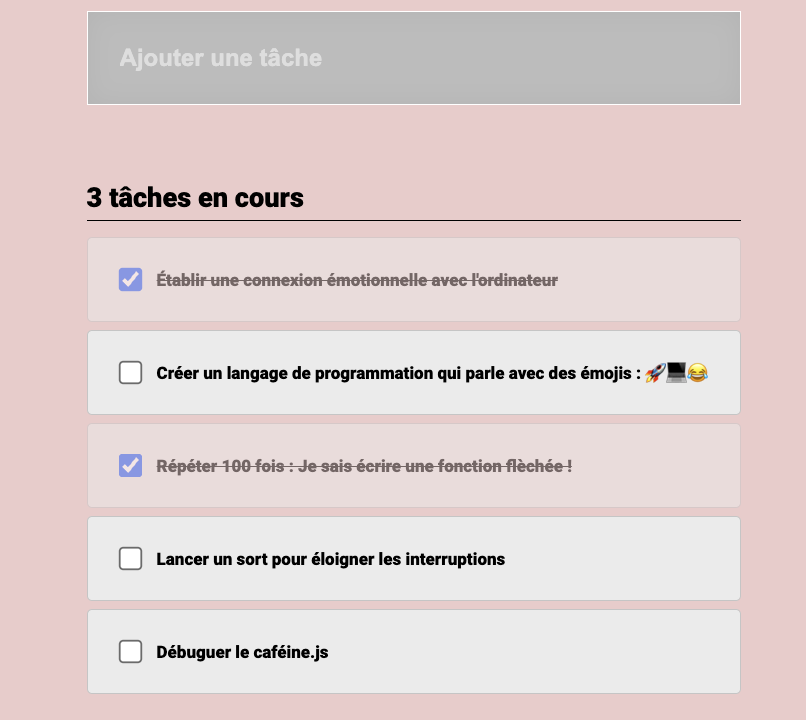

# To-do list

Révisons les fondamentaux de React, en créant une _to-do-list_

## Résultat visuel attendu

## Contraintes fonctionnelles & techniques

1. React.
2. L'interface doit être _construite_ en React : page HTML de départ vide de contenu ! _On gère tout de même les styles en CSS_
3. On doit pouvoir ajouter une tâche en écrivant dans l'input, puis en validant avec la touche `Entrée`.
4. On doit pouvoir cocher une tâche pour la marquer comme effectuée.
5. Et en bonus créer un compteur pour compter le nombre des tâches non effectuées et rajouter un `button` pour pouvoir supprimer un task.

## Instructions de l'exercice

Euh… pas d'instructions 😱
